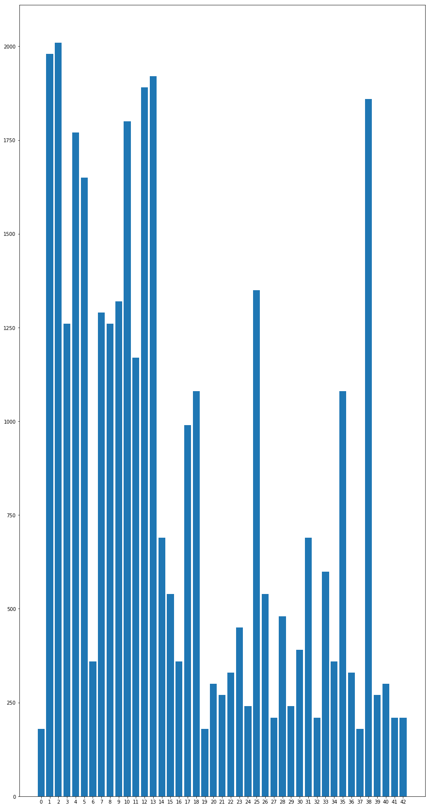
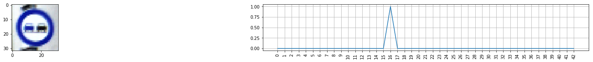

# **Traffic Sign Recognition** 

The goals / steps of this project are the following:
* Load the data set (see below for links to the project data set)
* Explore, summarize and visualize the data set
* Design, train and test a model architecture
* Use the model to make predictions on new images
* Analyze the softmax probabilities of the new images
* Summarize the results with a written report

[//]: # (Image References)

[image1]: ./examples/visualization.jpg "Visualization"
[image2]: ./examples/grayscale.jpg "Grayscaling"
[image3]: ./examples/random_noise.jpg "Random Noise"
[image4]: ./examples/placeholder.png "Traffic Sign 1"
[image5]: ./examples/placeholder.png "Traffic Sign 2"
[image6]: ./examples/placeholder.png "Traffic Sign 3"
[image7]: ./examples/placeholder.png "Traffic Sign 4"
[image8]: ./examples/placeholder.png "Traffic Sign 5"

## Rubric Points
### Here I will consider the [rubric points](https://review.udacity.com/#!/rubrics/481/view) individually and describe how I addressed each point in my implementation.  

---
### Project code

The  [Jupyter notebook](https://github.com/AlexanderKim/CarND-Traffic-Sign-Classifier-Project/blob/master/Traffic_Sign_Classifier.ipynb)

### Data Set Summary & Exploration

#### 1. Exporation of the dataset

* The size of training set is 34799
* The size of the validation set is 4410
* The size of test set is 12630
* The shape of a traffic sign image is (32, 32, 3)
* The number of unique classes/labels in the data set is 43

#### 2. Include an exploratory visualization of the dataset.

Below are random examples of signs per each class and quantities of images per each sign plotted

### Design and Test a Model Architecture

#### 1. Preprocessing

In regards of preprocessing I've used OpenCV. Specifically I've used [Normalize](https://docs.opencv.org/2.4/modules/core/doc/operations_on_arrays.html#normalize) function to scale pixel's values from 0 to 1

#### 2. Neural network architecture

My final model consisted of the following layers:

| Layer         		|     Description	        					| 
|:---------------------:|:---------------------------------------------:| 
| Input         		| 32x32x3 RGB image   							| 
| Convolution 5x5     	| 1x1 stride, VALID padding, outputs 28x28x6 	|
| RELU					|											    |
| Max pooling	      	| 2x2 stride, VALID padding outputs 14x14x6     |
| Convolution 5x5	    | 1x1 stride, VALID padding, outputs 10x10x16   |
| RELU          		|           									|
| Max pooling	      	| 2x2 stride, VALID padding outputs 5x5x16      |
| Flatten               | Input 5x5x16, output 400                      |
| Fully connected       | Input 400, output 84                          |
| RELU                  |												|
| Fully connected       | Input 400, output 43                          |
 

#### 3. Training and Accuracy

Model was trained with the following characteristics:
* Device: AWS GPU xLarge instance
* Optimizer: AdamOptimizer
* Learning rate: 0.001
* Epochs: 30
* Batch size: 128

Accuracy on validation set: 0.933

I was using LeNet model architecture due to it's proved efficiency in terms of images classification

### Test a Model on New Images

#### 1. Traffic signs downloaded from web

Here are five German traffic signs that I found on the web:

#### 2. Prediction results

Here are the results of the prediction:

| Image			        |     Prediction	        					| 
|:---------------------:|:---------------------------------------------:| 
| No entry      		| No entry   									| 
| No passing            | Vehicles over 3.5 metric tons prohibited      |
| Speed limit (20km/h)  | Speed limit (20km/h)                          |
| Keep right            | Keep right                                    |
| Pedestrians			| Pedestrians                                   |

The model was able to correctly guess 4 of the 5 traffic signs, which gives an accuracy of 80%.

#### 3. Predictions probabilities

")

